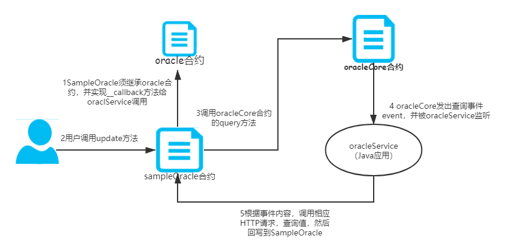

# Oracle-Service
   
### 原理简介：
   区块链是一个确定性的、封闭的系统环境，目前区块链只能获取到链内的数据，而不能获取到链外真实世界的数据，区块链与现实世界是割裂的。
   
   
   区块链是确定性的环境，它不允许不确定的事情或因素，智能合约不管何时何地运行都必须是一致的结果，所以虚拟机（VM）不能让智能合约有 network call（网络调用），不然结果就是不确定的。
   当智能合约的触发条件是外部信息时（链外），就必须需要预言机来提供数据服务，通过预言机将现实世界的数据输入到区块链上，因为智能合约不支持对外请求。
   也就是说智能合约不能进行 I/O（Input/Output，即输入/输出），所以它是无法主动获取外部数据的，只能通过预言机将数据给到智能合约。
   
   Oracle-Service是fisco链上的预言机服务，建议服务在TEE环境下安装和运行。此服务作用是负责取相关用户指定的url的数据，并回写到用户的合约上。方便用户在链上访问链下数据。
   并支持连接多链多群组，可同时为不同链和群组提供oracle服务。
   
   Oracle-Service 服务需配合OracleCore（在项目的contracts目录下）合约使用。 服务启动时会部署OracleCore合约或者加载OracleCore合约（如果已配置合约地址），然后监听此合约的事件。
   如图
   
   用户只需要参考SampleOracle.sol合约，部署此合约并调用oracle_setNetwork方法并传入oracleCore合约地址，这样Oracle-Service可以回写结果到用户的SampleOracle合约。用户就可以调用自己的SampleOracle合约查询到链下的数据。

### 部署说明：

## 1. 前提条件

| 依赖软件 | 支持版本 |
| :-: | :-: |
| Java | JDK8或以上版本 |
| FISCO-BCOS | V2.0.x版本 |

**备注：** Java推荐使用[OpenJDK](./appendix.html#java )，建议从[OpenJDK网站](https://jdk.java.net/java-se-ri/11) 自行下载（CentOS的yum仓库的OpenJDK缺少JCE(Java Cryptography Extension)，导致Web3SDK无法正常连接区块链节点）


## 2. 拉取代码
执行命令：
```
git clone -b https://github.com/WeBankFinTech/WeBASE-Oracle.git
```

进入目录：

```
cd WeBASE-Oracle
```

## 3. 编译代码


方式一：如果服务器已安装Gradle，且版本为Gradle-4.10或以上

```shell
gradle build -x test
```

方式二：如果服务器未安装Gradle，或者版本不是Gradle-4.10或以上，使用gradlew编译

```shell
chmod +x ./gradlew && ./gradlew build -x test
```

构建完成后，会在根目录WeBASE-Front下生成已编译的代码目录dist。

## 4. 修改配置

（1）进入dist目录

```
cd dist
```

dist目录提供了一份配置模板conf：


（2）进入conf目录：

```shell
cd conf
```

**注意：** 需要将节点所在目录`nodes/${ip}/sdk`下的`ca.crt`、`node.crt`和`node.key`文件拷贝到当前conf目录，供SDK与节点建立连接时使用。

（3）修改配置application.yml文件（根据实际情况修改）：


  多链多群组配置，注意不同的chain的节点没有任何p2p联系。
``` 
   group-channel-connections-configs:
     configs:
       - caCert: classpath:ca.crt   # 证书位置
         sslCert: classpath:node.crt
         sslKey: classpath:node.key
         chainId: 1           # 不同的链须自己表示ID
         all-channel-connections:
            - group-id: 1     #group ID
              connections-str:
                 - 127.0.0.1:20201 # node listen_ip:channel_listen_port
       - caCert: classpath:ca1.crt   
         sslCert: classpath:node1.crt
         sslKey: classpath:node1.key
         chainId: 2
         all-channel-connections:
            - group-id: 1 #group ID
              connections-str:
                 - 127.0.0.1:20200 # node listen_ip:channel_listen_port

```

  多链多群组监听配置
```
    event:
      eventRegisters:
        - chainId: 2
          group: 1
          contractAddress: ""  #监听的合约地址
          fromBlock: "latest"
          toBlock: "latest"
    
        - chainId: 1
          group: 1
          contractAddress: "0x8fcd8a0db3d335c5ef6fe3a4940875adb13eb789"
          fromBlock: "latest"
          toBlock: "latest"

```  

## 5. 服务启停

返回到dist目录执行：
```shell
启动: bash start.sh
停止: bash stop.sh
检查: bash status.sh
```
**备注**：服务进程起来后，需通过日志确认是否正常启动，出现以下内容表示正常；如果服务出现异常，确认修改配置后，重启提示服务进程在运行，则先执行stop.sh，再执行start.sh。

```
	Application() - main run success...
```

## 6. 查询不同不同链和群组的oracle-core合约地址

```
http://{deployIP}:{frontPort}/Oracle-Service/oracle/oracle-core-address?chainId=1&groupId=1
示例：http://localhost:5102/Oracle-Service/oracle/oracle-core-address?chainId=1&groupId=1
```

- 部署服务器IP和服务端口需对应修改，网络策略需开通
- 基于可视化控制台，可以开发智能合约，部署合约和发送交易，并查看交易和区块详情。还可以管理私钥，对节点健康度进行监控和统计

## 7. 查看日志

在dist目录查看：

```
前置服务日志：tail -f log/Oracle-Service.log
web3连接日志：tail -f log/web3sdk.log
```


### 使用注意事项：
 1 用户可以参考contracts/RandomOracle.sol合约实现自己的oracle合约。 首先必须集成usingOracleCore合约，并且实现__callback方法,此方法供oracle-service服务回调你的合约，将查询结果写到你的合约里。
  其次在update方法中填入自己要访问的链下API的URL。
 2 目前支持json和text/plain两种访问格式。并且链下API的url必须支持HTTPS访问。
 - plain(https://www.random.org/integers/?num=100&min=1&max=100&col=1&base=10&format=plain&rnd=new)
 - json(https://api.exchangerate-api.com/v4/latest/CNY).rates.JPY
  

