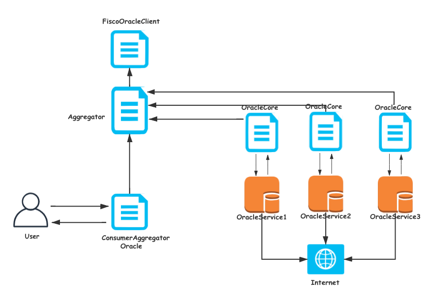

# Oracle-Service
   
### 1 原理简介：
   
   
#### 1.1 原理
   
   区块链是一个确定性的、封闭的系统环境，目前区块链只能获取到链内的数据，而不能获取到链外真实世界的数据，区块链与现实世界是割裂的。
   
   区块链是确定性的环境，它不允许不确定的事情或因素，智能合约不管何时何地运行都必须是一致的结果，所以虚拟机（VM）不能让智能合约有 network call（网络调用），不然结果就是不确定的。
   当智能合约的触发条件是外部信息时（链外），就必须需要预言机来提供数据服务，通过预言机将现实世界的数据输入到区块链上，因为智能合约不支持对外请求。
   也就是说智能合约不能进行 I/O（Input/Output，即输入/输出），所以它是无法主动获取外部数据的，只能通过预言机将数据给到智能合约。
   
   我们可以通过引入预言机（Oracle）的功能来解决这一问题，预言机可以为智能合约提供与外部世界的连接性。  
   Oracle-Service是fisco链上的预言机服务。此服务作用是负责取相关用户指定的url的数据，并回写到用户的合约上。方便用户在链上访问链下数据。
   并支持连接多链多群组，可同时为不同链和群组提供oracle服务。
   
   Oracle-Service 服务需配合OracleCore（在项目的contracts目录下）合约使用。 服务启动时会部署OracleCore合约或者加载OracleCore合约（如果已配置合约地址），然后监听此合约的事件。
   如图
   
   用户只需要参考ConsumerOracle.sol合约,继承我们提供的合约即可。
   目前支持 JSON、后续支持XML、HTML Parser
         
#### 1.2 作用

  保险方面，预言机的设计让智能合约保险在实现权利义务明确和自动执行（消除传统保险合约因陈述条款模糊而导致的纠纷）的基础上，更进一步的遏制保险欺诈，防止投保人和保险人的委托代理风险。  
  金融方面，获取汇率
  
#### 1.3 设计方案

   抗攻击：
   
   女巫攻击:
   Chainlink 计划通过对高质量的 Oracle 发起背书（认证）的方式，监控验证系统关于 Oracles 的统计数据
   复制攻击: Freeloading （吃空饷——预言者直接复制之前已提交答案的哈希值的行为）的问题
   
  WeBASE-Oracle是FISCO BCOS链上的预言机服务，在广泛调研市场上预言机项目的基础上针对联盟链设计的预言机服务。
  1 支持用户获取链下API数据  
  2 支持产生VRF随机数  
  3 支持去中心化部署和结果聚合
  并且同时支持国密。
  
  USER-SC 合约发出数据调用请求；
  ChainLink-SC 合约为预言者记录请求，并编译到 Core 命令行；
  Core 通过在合约程序前添加外部 API 来设置适配器，并分配任务 
  适配器将请求反馈给外部 API；
  ChainLink 收到预言机服务商的回复，并将其反馈给 Core 命令行；
  ChainLink Core 将数据报告给反馈给 ChainLink-SC；
  ChainLink-SC 汇总所有的答案，后反馈给用户端。

    
#### 1.3 快速开发  
   
   [快速开发自己的预言机](./develop.md)
   
   
### 2 功能
#### 2.1 API数据获取

   支持HTTPS的接口访问。
   
#### 2.2 VRF随机数生成
   
   
  采用k1椭圆曲线的VRF算法。链上合约验证Proof。
  用户提供随机数种子，oracle service服务方提供自己私钥，产生VRF的 proof。
  链上合约验证proof。
   [VRF介绍](./VRF.md)
   
#### 2.3 去中心化数据获取（聚合）

   支持用户选择多个oracle service帮获取数据。并进行聚合，聚合支持取中位数和平均数，后续支持更多聚合操作，最终将聚合结果返回给用户合约。
   此外会维护OracleServiceCenter注册中心，所有启动的oracle service节点需要在注册中心注册自己的相关信息，以方便用户选择oracle service服务方。
 
   
   

### 3 [安装部署](./install.md)  

### 4 使用注意事项：
 1 用户可以参考contracts/RandomOracle.sol合约实现自己的oracle合约。 首先必须集成usingOracleCore合约，并且实现__callback方法,此方法供oracle-service服务回调你的合约，将查询结果写到你的合约里。
  其次在update方法中填入自己要访问的链下API的URL。
 2 目前支持json和text/plain两种访问格式。并且链下API的url必须支持HTTPS访问。
 - plain(https://www.random.org/integers/?num=100&min=1&max=100&col=1&base=10&format=plain&rnd=new)
 - json(https://api.exchangerate-api.com/v4/latest/CNY).rates.JPY
  

