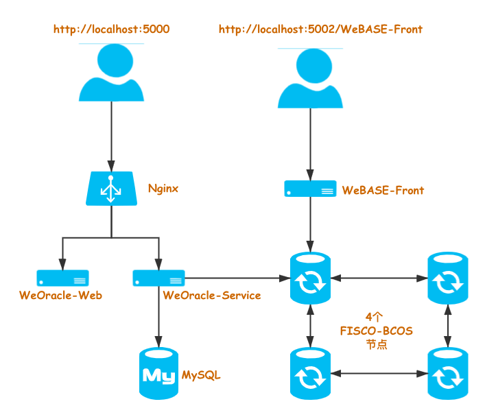

# WeOracle Docker 支持

**提示：** 使用 Docker 部署 WeOracle 服务时，**只支持 `Linux` 操作系统**。

##  部署架构
WeOracle 服务支持使用 Docker 方式部署和运行整个服务。为了方便使用 WeOracle 服务，进行 WeOracle 相关业务开发，在部署时，会部署一个 Solidity 合约的开发和调试环境（基于 WeBASE-Front）。

使用部署脚本部署后的结构如下：




* **WeBASE-Front**

    WeBASE-Front 是 [WeBASE](https://webasedoc.readthedocs.io/zh_CN/latest/docs/WeBASE-Front/README.html) 的一个子系统服务，针对 FISCO-BCOS 区块链服务提供 Solidity 合约可视化开发，编译，部署和调试功能。
    在进行 WeOracle 相关业务的合约开发和调试时，可以使用 WeBASE-Front 中的合约 IDE，方便合约的开发和调试，大大提高开发效率。

* **WeOracle-Web**
    
    WeOracle-Web 是 WeOracle 的页面控制台，主要四个功能提供：
    * 分页查询 Oracle 请求历史记录
    * 单个查询 Oracle 请求明细
    * WeOracle-Service 内置合约查询（合约地址）
    * 查询所有 WeOracle-Service 服务列表

* **WeOracle-Service**

    WeOracle-Service 是 WeOracle 的服务端，负责监听 FISCO-BCOS 链上与 Oracle 服务相关的事件。在收到 Oracle 请求事件时，通过调用 Http API 接口或者调用 VRF 生成库，获取请求结果后，并上传到链上，共计用户合约获取。
    具体，关于 WeOracle 原理，请参考：[TODO.]()


## 部署
### 系统要求
#### 操作系统

| 操作系统         |  版本最低要求     |  
| ------------- |:-------|
| CentOS|7.3（kernel >= 3.10.0-514）|
| RHEL(Red Hat)| 7.3（kernel >= 3.10.0-514）|
|Debian|Stretch 9  |
|Ubuntu|Xenial 16.04 (LTS)|


#### 硬件配置

|配置项      | 推荐配置 |
|------------- | -----|
| CPU | 2 核|
| 内存 | 4 GB |
| 存储 | 40 GB |


### 一键部署脚本
WeOracle 服务，提供一键部署脚本 `deploy.sh` 工具：

* 自动安装 `OpenSSL, curl, wget, Docker, Docker Compose` 依赖服务
* 调用 FISCO-BCOS 一键脚本，部署 4 个区块链底层节点
* 部署 WeBASE-Front 服务
* 部署 WeBASE-Oracle 服务
* 支持国密选项

### 部署
进入 `deploy.sh` 脚本所在目录，执行 `bash deploy.sh -d -p` 命令，其中：

  * `-d` 表示自动安装服务
  * `-p` 从 Docker 的官方仓库 `https://hub.docker.com/` 拉取 Docker 镜像

```Bash
[root@host]# bash deploy.sh -h
Usage:
    deploy.sh [-w v1.4.2] [-f v2.6.0] [-o v0.4] [-i fiscoorg] [-d] [-g] [-p] [-h]
    -w        WeBASE-Front version, default v1.4.2
    -f        FISCO-BCOS version, default v2.6.0.
    -o        WeOracle version, default v0.4.
    -i        Organization of docker images, default fiscoorg.
    -d        Install dependencies during deployment, default no.
    -g        Use guomi, default no.
    -p        Pull images from docker official registry of docker hub, default no.
    -h        Show help info.
```


### 启动

### 停止

## 编译镜像

### WeOracle-Service
